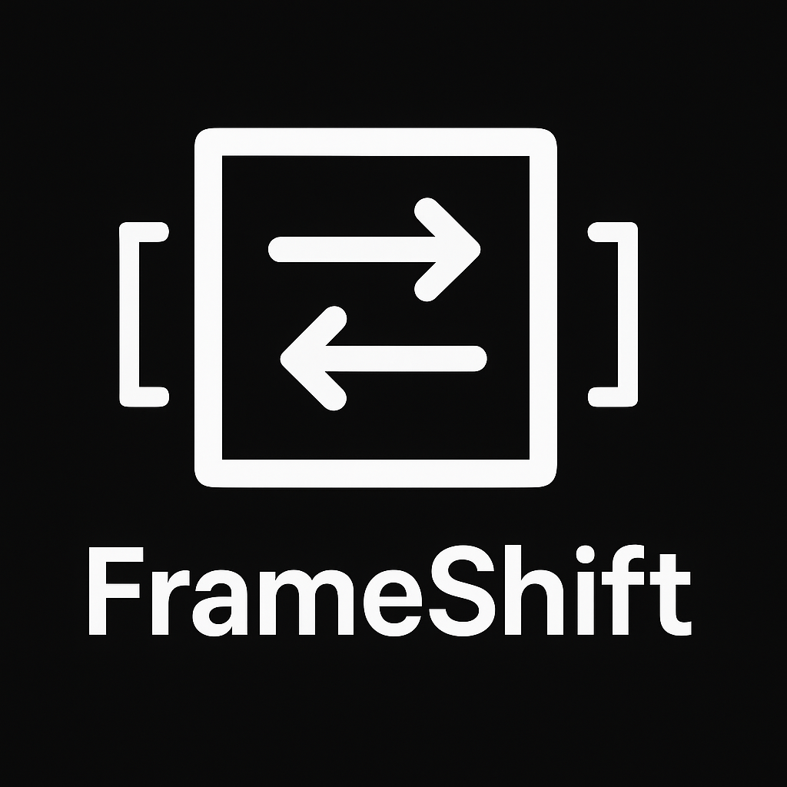

<a id="readme-top"></a>

<div align="center">
  

  <h1>FrameShift</h1>

  <p><strong>Reframe landscape video to vertical (or any aspect ratio) while keeping faces and objects in shot.</strong></p>

  <p>An open-source take on <a href="https://github.com/google/mediapipe/blob/master/docs/solutions/autoflip.md">Google AutoFlip</a>: detect what matters in each scene, crop around it, keep the audio.</p>

  [![License: MIT][license-shield]][license-url]
  [![Python][python-shield]][python-url]
  [![Last commit][last-commit-shield]][last-commit-url]
  [![Stars][stars-shield]][stars-url]
  [![Issues][issues-shield]][issues-url]

</div>

<!-- Add a demo GIF here once recorded:
  <p align="center"></p>
-->

## Contents

- [What it does](#what-it-does)
- [How it works](#how-it-works)
- [Install](#install)
- [Quick start (CLI)](#quick-start-cli)
- [GUI](#gui)
- [Command-line options](#command-line-options)
- [Object weights](#object-weights)
- [Limitations](#limitations)
- [Contributing](#contributing)
- [License](#license)

## What it does

FrameShift takes a video, splits it into scenes, finds the faces and objects in each scene, then picks one fixed crop per scene that keeps the important content inside a target frame (9:16 for Reels/Shorts, 1:1 for square, anything you ask for). The original audio is muxed back in with FFmpeg.

The crop is **stationary per scene** — one crop box held for the whole shot, recomputed at each cut. There's no panning or object tracking within a shot. That keeps the output stable and predictable; it also means fast subject movement inside a single long take can drift out of frame. See [Limitations](#limitations).

Models download themselves on first run into a local `models/` folder. Each file is checked against a pinned SHA-256 before it's loaded — a `.pt` is a pickle archive, so loading an unverified one would run whatever code it carries. A file that fails the check is deleted, not loaded.

- **Faces** — `yolov11n-face.pt` ([akanametov/yolo-face](https://github.com/akanametov/yolo-face)), with MediaPipe Face Detection as a fallback if the YOLO model won't load.
- **Objects** — `yolo11n.pt` (Ultralytics, 80 COCO classes). Only loaded when you ask for a non-face object weight > 0, so face-only runs stay light.

## How it works

1. **Scene detection** — PySceneDetect (`ContentDetector`) finds the cuts.
2. **Sampling** — up to 150 frames per scene are run through the detector.
3. **Weighted interest region** — every detection contributes to a centroid weighted by its `--object_weights` value and its area; the union of the boxes sets the size.
4. **Crop** — that region is expanded to the target aspect ratio and clamped to the frame.
5. **Render** — the crop fills the output (pan & scan), or fits inside it with padding (black / blurred / solid colour).
6. **Audio** — FFmpeg copies the original track onto the reframed video. No FFmpeg, no audio (you get a warning, the video still renders).

<p align="right">(<a href="#readme-top">back to top</a>)</p>

## Install

Python 3.8+ required.

```bash
git clone https://github.com/fralapo/FrameShift.git
cd FrameShift
pip install -r requirements.txt
```

FFmpeg is optional but needed to keep audio. Install it from [ffmpeg.org](https://ffmpeg.org/download.html) and make sure `ffmpeg` is on your `PATH`:

```bash
ffmpeg -version
```

The two detection models (~11 MB total) download on the first run and are verified by SHA-256 before use.

<p align="right">(<a href="#readme-top">back to top</a>)</p>

## Quick start (CLI)

Landscape to 9:16, cropped to fill the frame:

```bash
python -m frameshift.main input.mp4 output.mp4 --ratio 9:16
```

Fit the whole crop with black bars instead of cropping to fill:

```bash
python -m frameshift.main input.mp4 output.mp4 --ratio 1:1 --padding
```

Blurred bars instead of black (`--blur_amount` 0–10):

```bash
python -m frameshift.main input.mp4 output.mp4 --ratio 16:9 --padding --padding_type blur --blur_amount 5
```

Solid-colour bars (name or `(R,G,B)`):

```bash
python -m frameshift.main input.mp4 output.mp4 --ratio 4:3 --padding --padding_type color --padding_color_value "(0,0,255)"
```

Batch a folder:

```bash
python -m frameshift.main videos/ out/ --ratio 4:5 --batch
```

Each output's filename gets a `_reframed` suffix in batch mode.

<p align="right">(<a href="#readme-top">back to top</a>)</p>

## GUI

There's a Tkinter front-end covering most CLI options — input/output, ratio, padding, object weights, with a cancel button for long jobs.

```bash
python frameshift_gui.py
```

Full walkthrough: [FRAMESHIFT_GUI_MANUAL.md](FRAMESHIFT_GUI_MANUAL.md).

<p align="right">(<a href="#readme-top">back to top</a>)</p>

## Command-line options

| Option | Default | What it does |
|---|---|---|
| `input` | — | Input file, or directory with `--batch` |
| `output` | — | Output file, or directory with `--batch` |
| `--ratio` | `9/16` | Target aspect ratio: `9:16`, `1:1`, or a decimal like `0.5625` |
| `--padding` | off | Fit the crop inside the frame with bars instead of cropping to fill |
| `--padding_type` | `black` | `black`, `blur`, or `color` (needs `--padding`) |
| `--blur_amount` | `5` | Blur strength 0–10 when `--padding_type blur` |
| `--padding_color_value` | `black` | Bar colour name or `"(R,G,B)"` when `--padding_type color` |
| `--output_height` | `1080` | Output height in px; width follows from `--ratio` |
| `--interpolation` | `lanczos` | `nearest`, `linear`, `cubic`, `area`, `lanczos` |
| `--content_opacity` | `1.0` | Below 1.0, blends content over a blurred full-frame background |
| `--object_weights` | `face:1.0,person:0.8,default:0.5` | Per-class importance — see below |
| `--log_file` | none | Write DEBUG logs to a file |
| `--test` | off | Run a built-in sweep of scenarios against one input |
| `--batch` | off | Process every video in the input directory |

<p align="right">(<a href="#readme-top">back to top</a>)</p>

## Object weights

`--object_weights` decides what the crop chases. Higher weight = pulls the crop harder toward that class.

```bash
# Keep dogs in frame, care less about everything else
python -m frameshift.main in.mp4 out.mp4 --object_weights "face:1.0,dog:0.7,default:0.2"
```

- `face` is the dedicated face model (or MediaPipe fallback).
- Any [COCO class](https://github.com/ultralytics/ultralytics) — `person`, `car`, `dog`, `bottle`, etc. — comes from `yolo11n.pt`.
- The object model only runs when at least one non-face class has weight > 0, so the default face-and-person setup never loads it.
- `default` covers any detected class you didn't name.

<p align="right">(<a href="#readme-top">back to top</a>)</p>

## Limitations

Worth knowing before you rely on it:

- **One crop per scene.** No tracking or panning inside a shot. A subject that walks across a long take can leave the frame.
- **Output codec is `mp4v`.** Fine for previews, not the smallest or highest-quality option; re-encode with FFmpeg if you need H.264/H.265.
- **Dependencies are unpinned** in `requirements.txt`. Ultralytics and MediaPipe change APIs between releases, so a fresh install can pull a version that behaves differently. Pin them if you need reproducibility.
- **`--test` is an output generator, not an assertion suite** — it renders scenarios for you to eyeball, it doesn't pass/fail.

<p align="right">(<a href="#readme-top">back to top</a>)</p>

## Contributing

Issues and pull requests welcome at [github.com/fralapo/FrameShift](https://github.com/fralapo/FrameShift). If you hit a reframing result that looks wrong, attaching the input clip (or a short sample) makes it much easier to reproduce.

Ideas on the table: in-shot tracking/panning as an opt-in mode, configurable output codec, pinned dependencies.

## License

MIT. See [LICENSE](LICENSE).

<p align="right">(<a href="#readme-top">back to top</a>)</p>

[license-shield]: https://img.shields.io/github/license/fralapo/FrameShift?style=for-the-badge
[license-url]: LICENSE
[python-shield]: https://img.shields.io/badge/Python-3.8%2B-3776AB?style=for-the-badge&logo=python&logoColor=white
[python-url]: https://www.python.org/
[last-commit-shield]: https://img.shields.io/github/last-commit/fralapo/FrameShift?style=for-the-badge
[last-commit-url]: https://github.com/fralapo/FrameShift/commits/main
[stars-shield]: https://img.shields.io/github/stars/fralapo/FrameShift?style=for-the-badge
[stars-url]: https://github.com/fralapo/FrameShift/stargazers
[issues-shield]: https://img.shields.io/github/issues/fralapo/FrameShift?style=for-the-badge
[issues-url]: https://github.com/fralapo/FrameShift/issues
